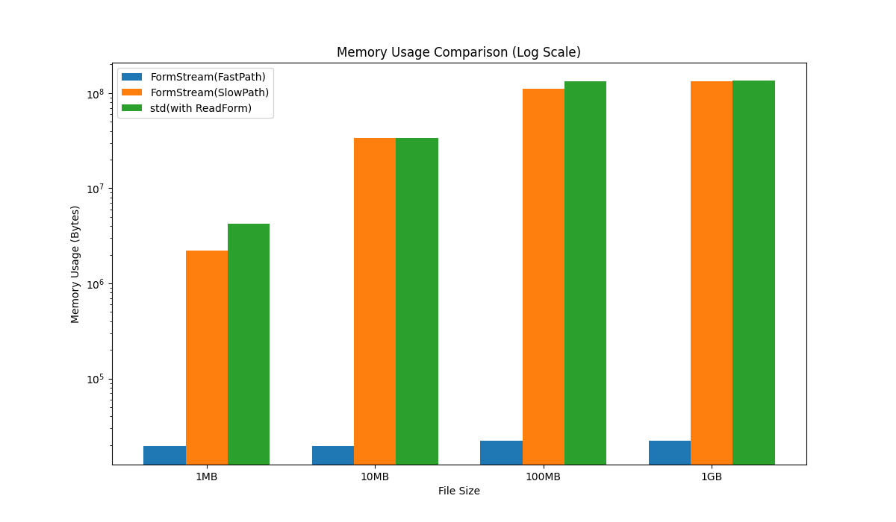
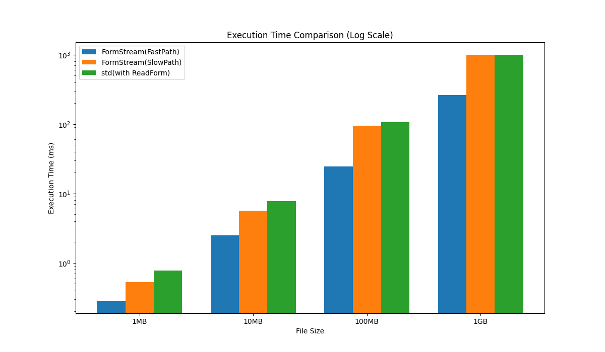

# FormStream

[](https://github.com/mazrean/formstream/releases/)

[](https://codecov.io/gh/mazrean/formstream)
[](https://pkg.go.dev/github.com/mazrean/formstream)

FormStream is a Golang streaming parser for multipart data, primarily used in web form submissions and file uploads.

## Features

- Provides a streaming parser, eliminating the need to store entire files in memory or on disk in most cases.
- Boasts extremely low memory usage.
- Delivers high performance, significantly faster than traditional methods.

## Benchmarks

Across all file sizes, FormStream outperforms the [`mime/multipart`](https://pkg.go.dev/mime/multipart) in both speed and memory efficiency.

<details>
<summary>Testing Environment</summary>

- OS: Ubuntu 22.04.2 LTS(WSL2 on Windows 11 Home)
- CPU: AMD Ryzen 9 7950X 16-Core Processor
- RAM: 32GB
- Disk: 512GB
- Go version: 1.22.0
</details>




> [!NOTE]
> FormStream excels in speed by employing a stream for parsing multipart data that meets specific conditions (as shown in the `FastPath` on the graph).
> It remains significantly efficient even under less ideal conditions (`SlowPath` on the graph), marginally outperforming [`mime/multipart`](https://pkg.go.dev/mime/multipart).
> For more details, see [Technical Overview](./#technical-overview).

## Installation

```sh
go get github.com/mazrean/formstream@latest
```

## Usage

### Basic Usage

<details>
<summary>Example Data</summary>

```text
--boundary
Content-Disposition: form-data; name="name"

mazrean
--boundary
Content-Disposition: form-data; name="password"

password
--boundary
Content-Disposition: form-data; name="icon"; filename="icon.png"
Content-Type: image/png

icon contents
--boundary--
```
</details>

```go
parser, err := formstream.NewParser(r)
if err != nil {
    return err
}

err = parser.Register("icon", func(r io.Reader, header formstream.Header) error {
    name, _, _ := parser.Value("name")
    password, _, _ := parser.Value("password")

    return saveUser(r.Context(), name, password, r)
}, formstream.WithRequiredPart("name"), formstream.WithRequiredPart("password"))
if err != nil {
    return err
}

err = parser.Parse()
if err != nil {
    return err
}
```

### Integration with Web Frameworks

FormStream offers wrappers for popular web frameworks:

|Framework|Integration Package|
|-|-|
|[net/http](https://pkg.go.dev/net/http)|[httpform](./http)|
|[Echo](https://echo.labstack.com/)|[echoform](./echo)|
|[Gin](https://gin-gonic.com/)|[ginform](./gin)|

## Technical Overview

FormStream introduces a more efficient method for processing multipart data. 

### Understanding Multipart Data

Multipart data is organized with defined boundaries separating each segment. Here's an example:

```text
--boundary
Content-Disposition: form-data; name="description"

file description
--boundary
Content-Disposition: form-data; name="file"; filename="large.png"
Content-Type: image/png

large png data...
--boundary--
```

For large files, streaming the data is vital for efficient memory usage. In the example above, streaming is made possible by sequentially processing each part from the beginning, which can be achieved using the [`(*Reader).NextPart`](https://pkg.go.dev/mime/multipart#Reader.NextPart) method in the [`mime/multipart`](https://pkg.go.dev/mime/multipart) package.

### Alternative Parsing Method

The [`mime/multipart`](https://pkg.go.dev/mime/multipart) package also includes the [`(*Reader).ReadForm`](https://pkg.go.dev/mime/multipart#Reader.ReadForm) method. Unlike streaming, this method stores data temporarily in memory or on a file, leading to slower processing. It's widely used in frameworks like `net/http`, `Echo`, and `Gin` due to its ability to handle parts in any order. For instance:

```text
--boundary
Content-Disposition: form-data; name="file"; filename="large.png"
Content-Type: image/png

large png data...
--boundary
Content-Disposition: form-data; name="description"

file description
--boundary--
```

With [`(*Reader).NextPart`](https://pkg.go.dev/mime/multipart#Reader.NextPart), processing strictly follows sequential order, making it challenging to handle such data where later parts contain information necessary for processing earlier ones.

### Efficient Processing Strategies

Optimal multipart handling strategies include:
- Stream processing with [`(*Reader).NextPart`](https://pkg.go.dev/mime/multipart#Reader.NextPart) when all necessary data is immediately available.
- Temporarily storing data on disk or memory, then processing it with [`(*Reader).ReadForm`](https://pkg.go.dev/mime/multipart#Reader.ReadForm) when needed.

### Advantages of FormStream

FormStream enhances this process. It outpaces the [`(*Reader).ReadForm`](https://pkg.go.dev/mime/multipart#Reader.ReadForm) method and, unlike [`(*Reader).NextPart`](https://pkg.go.dev/mime/multipart#Reader.NextPart), can handle multipart data in any order. This adaptability makes FormStream suitable for a range of multipart data scenarios.

## Supports

This project receives support from GMO FlattSecurity's “GMO Open Source Developer Support Program” and regularly conducts security assessments using “Takumi byGMO.”

<a href="https://flatt.tech/oss/gmo/trampoline" target="_blank"></a>
